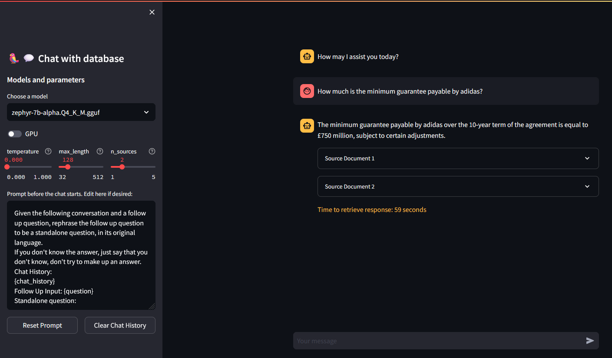

# Running Llama 2 and other Open-Source LLMs on CPU Inference Locally for Document Q&A

## Preface
This is a fork of Kenneth Leung's original repository, that adjusts the original code in several ways:
- A streamlit visualisation is available to make it more user-friendly
- Follow-up questions are now possible thanks to memory implementation
- Different models now appear as options for the user
- Multiple other optimalisations 

___
## Quickstart
- Ensure you have downloaded the model of your choice in GGUF format and placed it into the `models/` folder. Some examples:
    - https://huggingface.co/TheBloke/Llama-2-7b-Chat-GGUF
    - https://huggingface.co/TheBloke/Mistral-7B-Instruct-v0.1-GGUF

- Fill the `data/` folder with .pdf, .doc(x) or .txt files you want to ask questions about

- To build a FAISS database with information regarding your files, launch the terminal from the project directory and run the following command  
`python db_build.py`

- To start asking questions about your files, run the following command:  
`streamlit run main_st.py`

- Choose which model to use for Q&A and adjust parameters to your liking

___
## Tools
- **LangChain**: Framework for developing applications powered by language models
- **LlamaCPP**: Python bindings for the Transformer models implemented in C/C++
- **FAISS**: Open-source library for efficient similarity search and clustering of dense vectors.
- **Sentence-Transformers (all-MiniLM-L6-v2)**: Open-source pre-trained transformer model for embedding text to a 384-dimensional dense vector space for tasks like clustering or semantic search.
- **Llama-2-7B-Chat**: Open-source fine-tuned Llama 2 model designed for chat dialogue. Leverages publicly available instruction datasets and over 1 million human annotations. 

___
## Files and Content
- `/assets`: Images relevant to the project
- `/config`: Configuration files for LLM application
- `/data`: Dataset used for this project (i.e., Manchester United FC 2022 Annual Report - 177-page PDF document)
- `/models`: Binary file of GGUF quantized LLM model (i.e., Llama-2-7B-Chat) 
- `/src`: Python codes of key components of LLM application, namely `llm.py`, `utils.py`, and `prompts.py`
- `/vectorstore`: FAISS vector store for documents
- `db_build.py`: Python script to ingest dataset and generate FAISS vector store
- `db_clear.py`: Python script to clear the previously built database
- `main_st.py`: Main Python script to launch the streamlit application 
- `main.py`: Python script to launch an older version of the application within the terminal, mainly used for testing purposes
- `requirements.txt`: List of Python dependencies (and version)
___

## References
- https://huggingface.co/TheBloke
- https://github.com/abetlen/llama-cpp-python
- https://python.langchain.com/docs/integrations/llms/llamacpp